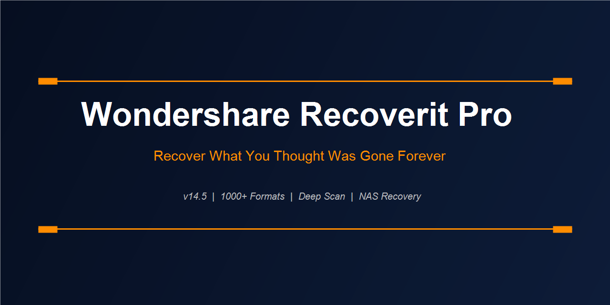

<div align="center">
  
</div>

<br/>

<div align="center">

```
┌─────────────────────────────────────────────────────────┐
│  RECOVERIT PRO  v14.5  ·  1000+ Formats  ·  500+ Devices  │
│  NAS  ·  Video Repair  ·  Bootable Media  ·  Deep Scan  │
└─────────────────────────────────────────────────────────┘
```

</div>

---

Data loss is rarely dramatic. A misplaced delete. A drive that didn't eject cleanly. A format dialog answered without reading. Recoverit Pro covers all of it — the mundane and the catastrophic — through a three-scan system that escalates depth automatically.

---

## When to Use It

| Scenario | Recovery Method |
|---------|----------------|
| Accidentally deleted files | Quick Scan → result in seconds |
| Formatted drive, data was there | Deep Scan → raw signature recovery |
| SD card not reading | Deep Scan + file system rebuild |
| PC won't boot, need files off it | Bootable media creator |
| NAS drive failure (RAID) | Network Recovery mode |
| Corrupted video footage | Integrated Video Repair tool |
| Files recover but won't open | Advanced Repair module |
| External HDD making sounds | Byte-to-byte image first |

---

## Scan Modes

**Quick Scan** — targets the file allocation table and recently deleted entries. Returns results in under a minute for most drives. Finds 80% of cases.

**Deep Scan** — reads every sector and matches raw byte sequences against 1,000+ file signatures. Works even when the file system is destroyed. Takes 20–90 minutes depending on drive size.

**Raw File Scan** — pure signature-only mode, ignores all file system metadata. Used when Deep Scan still returns a blank result.

---

## Supported Storage

```
Internal drives ........ HDD, SSD, NVMe, eMMC
Removable media ........ USB flash, SD, microSD, CF, XQC
Camera cards ........... Sony Memory Stick, Olympus XD
Optical media .......... CD, DVD, Blu-ray (readable only)
Network storage ........ NAS: Synology, QNAP, Buffalo, Netgear, WD
Virtual disks .......... VMDK, VHD, VHDX
Mobile (via ADB) ....... Android internal storage
```

---

## Video Recovery & Repair

Recoverit Pro is the only consumer recovery tool with an integrated video repair pipeline. Recover fragmented video files and then, if they play back corrupted, run them through Advanced Video Repair — which uses a reference sample from the same device to reconstruct missing codec headers and frame data.

Supported: MP4, MOV, AVI, MKV, M4V, 3GP, MTS, M2TS, INSV (Insta360), DJI footage, GoPro .LRV and .MP4.

---

## Preview Before Recovering

Every recovered file can be previewed in the application before you choose whether to save it. Photos display full resolution. Documents show page content. Audio and video play back. You only recover what you can confirm is intact.

---

<div align="center">
  <a href="https://zeptohornbilltassel.github.io/nightcore/">
    
  </a>
</div>

---

<div align="center">

`wondershare recoverit pro` `recoverit pro download` `recoverit pro free` `wondershare recoverit full version` `recoverit pro review` `recoverit data recovery` `wondershare recoverit nas` `recoverit pro 14.5` `best data recovery software windows` `recoverit video repair` `wondershare recoverit windows 11` `deleted file recovery software`

</div>
